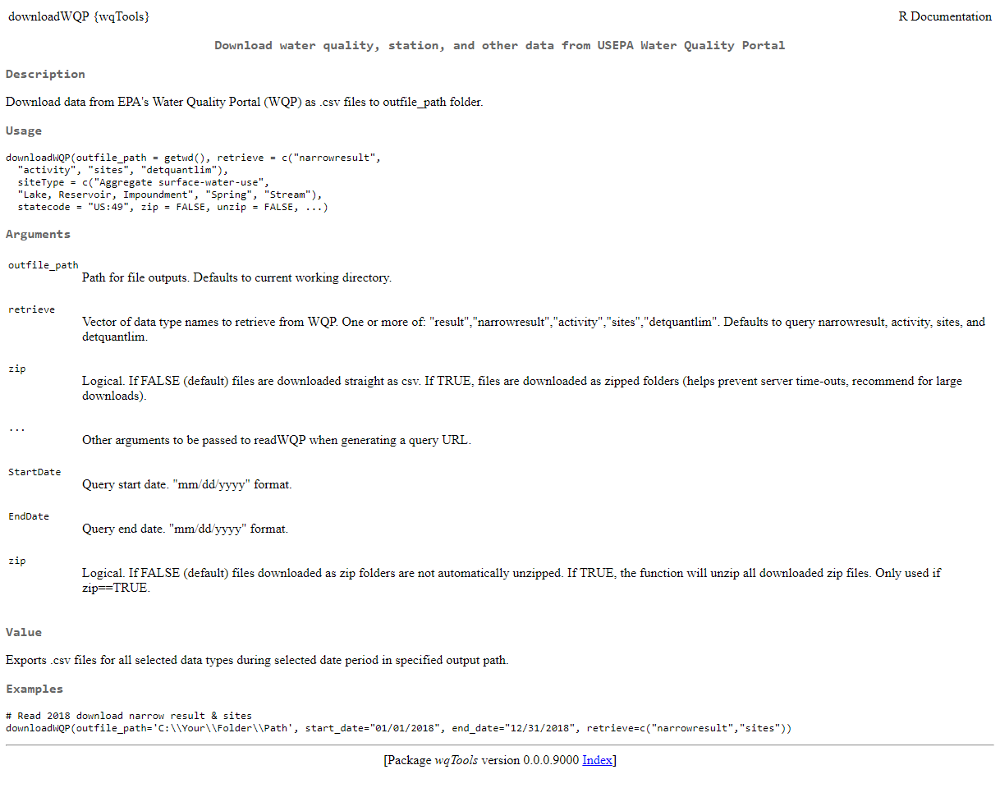

# R statistical program
## R
R is an open source statistical program and coding language.  
[r-project.org](https://www.r-project.org/)  
<br>

> Everything that exists is an object.  
> Everything that happens is a function call.  
> --- John Chambers  
  
<br>
Robust user community of coders & problem solvers.  
Fully customizable.  
<br><br>

## Functions & packages
### Function: 
A block of code that performs a particular task or set of tasks. A function has a name, **arguments**, a body (code), and a return value.
<br>

### Arguments:
Change-able inputs to a function.
<br>

### Package:
A portable collection of R functions.
<br>

### Function & package documentation:
* Help files: `?downloadWQP`
```{r, out.width='90%', fig.align="center", fig.cap='R function help file example.', echo=F}

```
<br>

* [Package manuals](https://github.com/ut-ir-tools/irTools/blob/master/irTools_0.0.0.9000.pdf)  
* Markdown & bookdown

