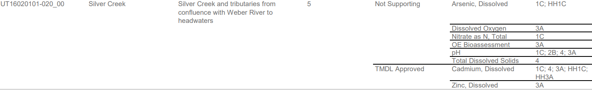

# Assessments

## Conventionals (rivers & streams, non-ALU lake surface)

### Count exceedances
```{r, count-exc-conv}
conv_exc=countExceedances(conventionals)
```
<br>

```{r, echo=F, fig.cap='Count exceedances example output from conventionals data.'}
DT::datatable(conv_exc, rownames=FALSE, filter="top",
				options = list(scrollY = '600px', scrollX=TRUE, paging = TRUE, dom="tpr", deferRender = TRUE)
			)
```

### Assess exceedances

```{r, out.width='70%', fig.align="center", echo=F, fig.cap='Rivers and streams conventional assessment methods outline. Interpreted in R, the whole flowchart is a function, the diamonds are arguments, and the ovals are the return values.'}
knitr::include_graphics('99-other-files/images/Rivers-ConventionalAssess.png')
```
<br>

```{r, assess-exc-conv}
conv_assessed=assessExcCounts(conv_exc, min_n=10, max_exc_pct=10, max_exc_count_id=1)
```
<br>


```{r, echo=F}
tab=data.frame(table(conv_assessed$IR_Cat))
names(tab)=c('IR Category', 'Frequency')
```

```{r, echo=F}
knitr::kable(tab, caption='Conventionals assessment category frequencies.')
```
<br><br>

```{r, echo=F, fig.cap='Assessed exceedances example output from conventionals data.'}
DT::datatable(conv_assessed, rownames=FALSE, filter="top",
				options = list(scrollY = '600px', scrollX=TRUE, paging = TRUE, dom="tpr", deferRender = TRUE)
			)
```

<br><br>
```{r, echo=F, fig.cap='Map of site-level TDS assessments.'}
tds=subset(conv_assessed, R3172ParameterName=='Total Dissolved Solids')
tds=unique(tds[,c('IR_MLID','IR_Lat','IR_Long','ASSESS_ID','AU_NAME','BEN_CLASS','SSC_StartMon','SSC_EndMon','SSC_MLID','SampleCount','ExcCount','IR_Cat')])
tds=within(tds, {
	color=NA
	color[IR_Cat=='NS']='red'
	color[IR_Cat=='FS']='green'
	color[IR_Cat=='idE']='orange'
	color[IR_Cat=='idNE']='yellow'
	lat=wqTools::facToNum(tds$IR_Lat)
	long=wqTools::facToNum(tds$IR_Long)
})

library(leaflet)
wqTools::buildMap() %>%
	addCircleMarkers(data=tds, lat=~lat, lng=~long, options = pathOptions(pane = "markers"), group="Sites", color=~color,
					popup = paste0(
					"MLID: ", tds$IR_MLID,
					"<br> AU name: ", tds$AU_NAME,
					"<br> Beneficial uses: ", tds$BEN_CLASS,
					"<br> Sample count: ", tds$SampleCount,
					"<br> Exceedance count: ", tds$ExcCount,
					"<br> Category: ", tds$IR_Cat
					)
	) %>%
	addLayersControl(
		position ="topleft",
		baseGroups = c("Topo","Satellite"),overlayGroups = c("Sites", "Assessment units","Beneficial uses", "Site-specific standards"),
		options = layersControlOptions(collapsed = FALSE)
	)

```

## Toxics
### Count exceedances
```{r, count-exc-toxics}
toxics_exc=countExceedances(toxics)
```

### Assess exceedances
```{r, assess-exc-toxics}
toxics_assessed=assessExcCounts(toxics_exc, min_n=4, max_exc_count=1, max_exc_count_id=0)
```

## Lake profiles (not run)
```{r, assess-lake-profs, eval=F}
assessed_profs=assessLakeProfiles(lake_profiles)
```

## E.coli (not run)
```{r, assess-ecoli, eval=F}
assess_ecoli = assessEColi(prepped_data$ecoli)
```

## HFDO (not run)
```{r, assess-hfdo, eval=F}
assess_hfdo = assessHFDO(hfdo_data, min_n = 10)
```

## Write out assessments
```{r, write-asmnts}
assessments=list(toxics_assessed=toxics_assessed, conv_assessed=conv_assessed)
save(assessments, file='04-assessments/assessments-2016.Rdata')
```

# Rollup
```{r, roll-up}
au_use_param_assessments=rollUp(data=assessments, group_vars=c("ASSESS_ID","AU_NAME", "BeneficialUse","R3172ParameterName"), expand_uses=TRUE)
au_use_assessments=rollUp(data=assessments, group_vars=c("ASSESS_ID","AU_NAME", "BeneficialUse"), expand_uses=TRUE)
au_assessments=rollUp(data=assessments, group_vars=c("ASSESS_ID","AU_NAME"), expand_uses=TRUE)
```

<br><br>

```{r, echo=F, fig.cap='AU-use-parameter level assessment rollup.'}
#knitr::kable(head(au_use_param_assessments), )
DT::datatable(au_use_param_assessments, rownames=FALSE, filter="top",
				options = list(scrollY = '600px', scrollX=TRUE, paging = TRUE, dom="tpr", deferRender = TRUE)
			)
```
<br><br>
```{r, out.width='95%', fig.align="center", echo=F, fig.cap='Silver Creek assessment table from 2016 IR. Note matching impairments for arsenic, cadmium, & total dissolved solids in AU level rollup example data.'}

```
<br><br>

```{r, echo=F, fig.cap='AU level assessment rollup example.'}
#knitr::kable(head(au_assessments))
DT::datatable(au_assessments, rownames=FALSE, filter="top",
				options = list(scrollY = '600px', scrollX=TRUE, paging = TRUE, dom="tpr", deferRender = TRUE)
			)
```


<br><br><br><br><br><br><br><br><br><br><br><br>


