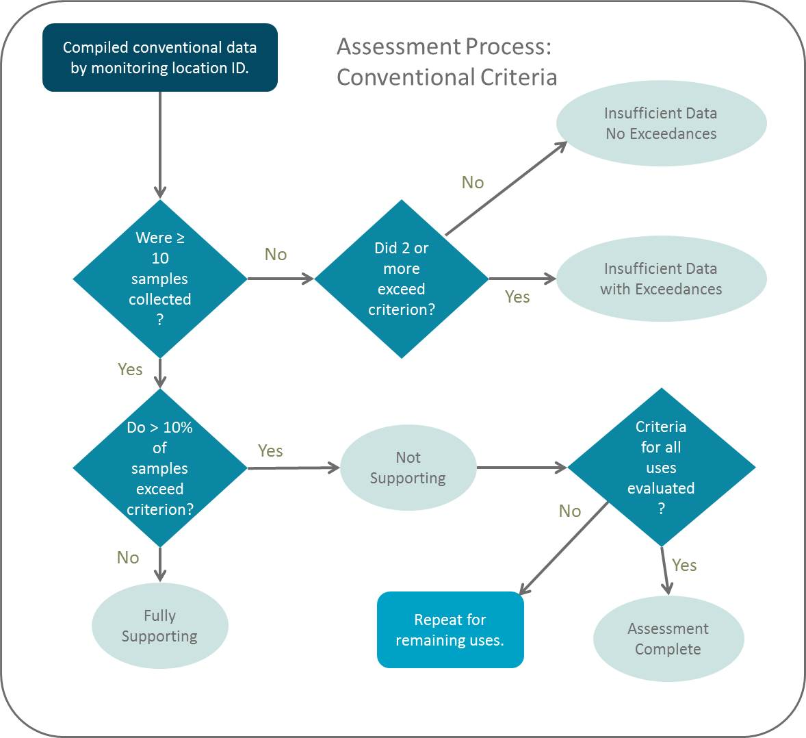

# Assessments

```{r, out.width='70%', fig.align="center", echo=F, fig.cap='Rivers and streams conventional assessment methods outline. Conventional assessments 
are performed using two irTools functions: countExceedances() & assessExcCounts(). These functions take arguments following the decision points in the flowchart; 
thus allowing rapid flexibility in changes to these methods.'}

```

## Rivers & streams conventionals
DT::datatable(conventionals[1:100,])

### Count exceedances
conv_exc=countExceedances(conventionals)
conv_exc[conv_exc$IR_MLID=="UTAHDWQ_WQX-4960740",]

### Assess exceedances
conv_assessed=assessExcCounts(conv_exc, min_n=10, max_exc_pct=10, max_exc_count_id=1)
table(conv_assessed$IR_Cat)
head(conv_assessed[conv_assessed$IR_Cat=="NS",])


## Toxics


## Lake profiles