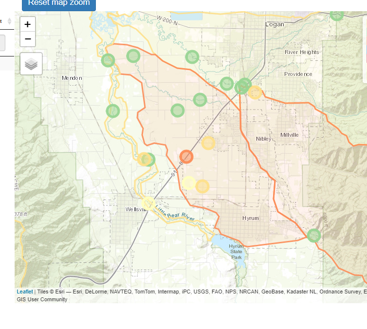
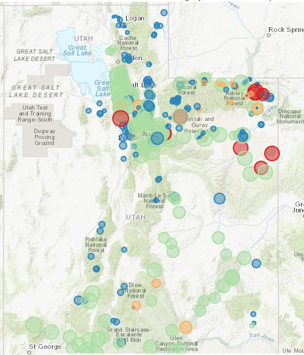
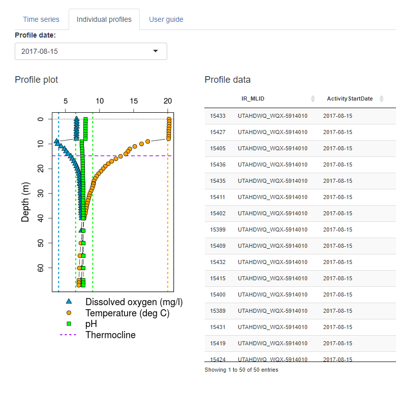
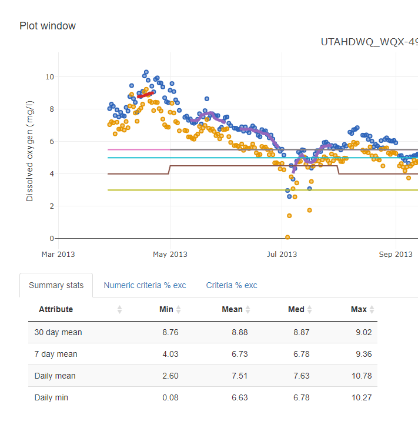

# (PART) Applications {-}

# Assessment review applications

## Assessment unit & site assessment review dashboard
[udwq.shinyapps.io/au-site-asmnt-demo](https://udwq.shinyapps.io/au-site-asmnt-demo/)

  

## Toxic & conventionals assessment review dashboard
[udwq.shinyapps.io/toxicsConventionalsDashboard](https://udwq.shinyapps.io/toxicsConventionalsDashboard/)  

  

## Lake profile dashboard
[udwq.shinyapps.io/lakeprofiledashboard](https://udwq.shinyapps.io/lakeprofiledashboard/)

  

## High frequency DO dashboard
[udwq.shinyapps.io/hfdoDashboard](https://udwq.shinyapps.io/hfdoDashboard/)

  

## Utah Lake Data Explorer
[udwq.shinyapps.io/UtahLakeDataExplorer](https://udwq.shinyapps.io/UtahLakeDataExplorer/)

  

## Ecoli dashboard
[udwq.shinyapps.io/ecoliDataExplorer](https://udwq.shinyapps.io/ecoliDataExplorer/)

  

